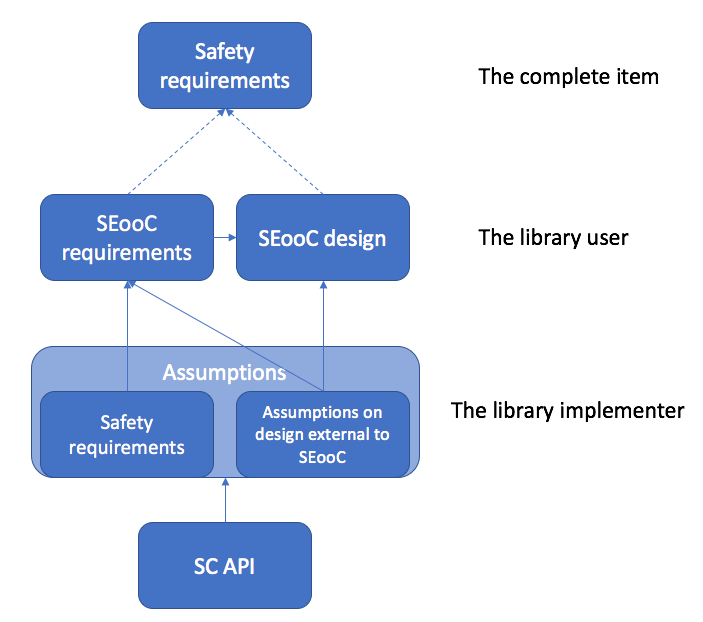

// (C) Copyright 2014-2017 The Khronos Group Inc. All Rights Reserved.
// Khronos Group Safety Critical API Development SCAP
// document
//
// Text format: asciidoc 8.6.9
// Editor:      Asciidoc Book Editor
//
// Description: Guidelines 3.2.16 Guidelines Git #29

:Author: Illya Rudkin (spec editor)
:Author Initials: IOR
:Revision: 0.03

// Hyperlink anchor, the ID matches those in
// 3_1_GuidelinesList.adoc
[[gh29]]

ifdef::basebackend-docbook[]
=== Development out of context
endif::[]
ifdef::basebackend-html[]
=== {chapter-id}.{chapter-sub-id}.{counter:section-id}. Development out of context
endif::[]

For many domains like avionics, automotive or medicine there is a whole supply chain from the low -level components to the component that is the complete item; a car or plane. The safety standards for those domains want the process of quality control to be applied to all parts of the supply chain. Hazard analysis is carried out and safety goals identified in the context of the use of the item. However, for lower level component makers, who create discrete smaller parts whether hardware or software, there are often no clearly defined user cases. They do not know how their parts would be used in the final vehicle and what other components and systems they would have to interact with.

The ISO 26262 standard tries to address this by introducing the concept of safety element out of context (SEooC). This concept asks you to list the assumptions that have been made to support the safety goals of the item out of context. It is the responsibility of the OEM or tier 1 supply to define the safety goals and functional safety concept and communicate that down the supply chain.

However, it may be often the case that there is not yet a tier 1 type client driving the development for a complete item and so the sub-item is to be developed with no guidance from above. From the perspective of the SC API implementer the safety mechanisms must be created yet be adaptable so when the customer appears those mechanisms can be modified to fit the client’s use cases. The target is to avoid making assumptions that lead to inflexibility with yet unknown use cases and the safety standards that apply.

The documentation to support the assumptions needs to be comprehensive. It needs to cover:

*   Safety manual. How to use the device.
*   Failure mode and effects analysis. Strategy to fail safe.
*   The development interface report (DIA). Agreement of responsibilities for the implementer and the supplier of the item.
*   The testing and verification process used to validate safety goals and assumptions

[[SEooC, 3.2.18.1]]
.SC API out of context
[.right.text-center]

The Khronos SC API itself is very much SEooC and it must be designed to be robust yet flexible enough to accommodate the implementers with their unique safety goals and assumptions.
