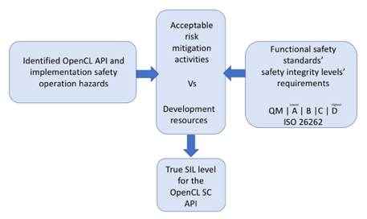

// (C) Copyright 2014-2018 The Khronos Group Inc. All Rights Reserved.
// Khronos Group Safety Critical API Development SCAP
// document
//
// Text format: asciidoc 8.6.9
// Editor:      Asciidoc Book Editor
//
// Description: Guidelines 3.2.16 Guidelines Git #30

:Author: Illya Rudkin (spec editor)
:Author Initials: IOR
:Revision: 0.041

// Hyperlink anchor, the ID matches those in
// 3_1_GuidelinesList.adoc
[[gh31]]

ifdef::basebackend-docbook[]
=== Perform a hazard risk analysis and create a safety goals report
endif::[]
ifdef::basebackend-html[]
=== {chapter-id}.{chapter-sub-id}.{counter:section-id}. Perform a hazard risk analysis and create a safety goals report
endif::[]

==== Introduction
This document describes a possible approach a Khronos working group (WG) or technical sub-group (TSG) could start development of a safety critical (SC) API.  It suggests first that the group perform a Hazard Risk Analysis (HARA) in order to create a list of specification requirements or safety requirements on an existing Khronos API or new SC API. It also suggests that the group work up from the lowest safety integrity level (SIL) demands through to the higher SILs gradually so that an appreciation of the work needed is understood. The Khronos Safety Critical Advisory Forum (KSCAF) will assist by feed the group the appropriate SIL demands. Should a group be taking an existing API to form a SC version the group does not have to wait to be given all the safety requirements up front as it should be very aware of current undesirable characteristics the current non-SC version that should not be present. This will enable the group through an iterative process be able to determine the target functional safety level with which to aim for to satisfy one or more specified functional safety standards.
Safety Critical Systems Development is a large end-to-end (from requirements through sustaining engineering) problem that involves first and foremost a very good quality management process - quality managed (QM). A lot of the demands functional safety standards ask for cannot be codified to a large extent in an SC API specification. The API can support the things that are important to a good quality management process, such as removing ambiguities from the API specification and improving APIs as needed to support certain application needs. To this end, the following items are a good first step:

1. The current ambiguities in the OpenCL specification are addressed. If a particular behaviour cannot be specified for different types of targets (GPUs, FPGAs for example), then we think it's ok to push those specified behaviours to the vendor. It could be case that the SC API specification says the vendor must describe a behaviour to some standard in order to meet the intent of having an SC API specification.
2. For performance requirements (latency, meeting deadlines, etc.), this is very much a systems level behaviour and is outside of the scope of an SC API specification, but it has to considered when understanding hazards. Any specific latency or throughput behaviours need to be specified by the vendor and not in the SC API specification. It could be the case that specific changes to APIs and behaviours could be suggested in order to help improve those characteristics, but those changes should not describe guarantees.

==== Functional safety analysis work to perform
While the working should strive to obtain the highest compatibility with the higher levels of safety rigor required by the different functional safety standards in various domains such as the automotive industry's ISO 26262 standard, it is reasonable for the group to aim for lower safety rigor for the first round of work. The findings from that work will form a foundation to go forward. The work will record the hazard investigation, the operational hazards identified, identified safety goals and the mitigation actions that the group is willing to carry out based on the time constraints and the group's resources.

Much but not all of the work carried out to satisfy the lower safety critical requirements will also go towards meeting the requirements of higher levels of safety rigor of the same standard.

Similar to other functional safety standards the automotive industry's functional safety standard ISO 26262 has four levels of safety integrity or SIL (ASIL - automotive SIL). It also has an additional QM level. The rigor applied is based on each SIL's demand for verification quality procedures. The higher the SIL the more demand and types of demands. QM just means follow only a quality managed development life cycle like ISO 9001. A SC group is expected to perform safety analysis to at least the lowest SIL level for the functional standard being aimed for.

[[HARA_work_flow, 3.2.20.31]]
.HARA_work_flow

NOTE: True SIL in the diagram is not the SIL level Khronos will 'label' the API specification, it is the SIL level the working group used as a reference. Indicating the SIL with which the group aimed for should be documented. It is the implementation vendor who will specify the SIL level based on their use case for the item.

For the group to obtain their desired SIL level the group first has to carry out a hazard risk analysis of the item (e.g. OpenCL API + implementation behaviour) in its operational context which is in this case is a system out of context. Based on the item's operational criteria (which in part is not known at this time) the group using its experience of working with non- safety critical implementations of OpenCL can first create a list of all the currently known operation hazards or undefined behaviours of the current API and the implications for an implementation. This initial list will form the basis on which to grow the identified issues asked of the relevant lower SIL levels demands the group is wishing to target.

An identified safety hazard can be equivalent to one specification requirement or it can be very broad covering many specification requirements. For example:

1. Safety hazard: The implementation can lock up and become unresponsive
2. Safety goal: Implement a mechanism by which the lock up does not cause the host application to enter an unknown state and can respond to initiate specified intended actions.

Many API specification design faults could be applied to this one safety goal. One of many responses to this goal could be to remove all un-deterministic behaviour currently allowed. If you did remove all un-deterministic behaviour have you satisfied this goal?

The guideline steps to follows:

- Remove undetermined behaviour characteristics
- Improve the status and error reporting capability such that the application using the library can respond and initiate a recovery action
- The implementation can operate in a deterministic safe way should the dependant hardware fail
- Calls into the implementation operate with specified time constraints where necessary
-	Exceptions cannot be thrown across an API boundary
- Identify possible single point and multi-point operational failures
- How to implement an initialisation phase to allocate operational resources and reduce or remove dynamic allocation (and return status)
- How to implement a shutdown phase to release operational resources (and return status)
