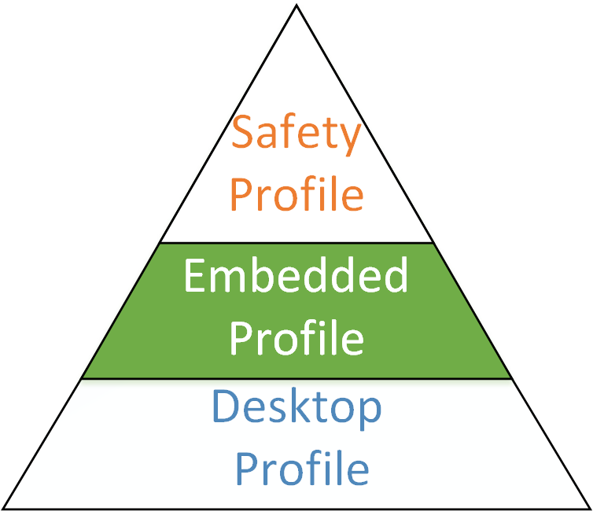
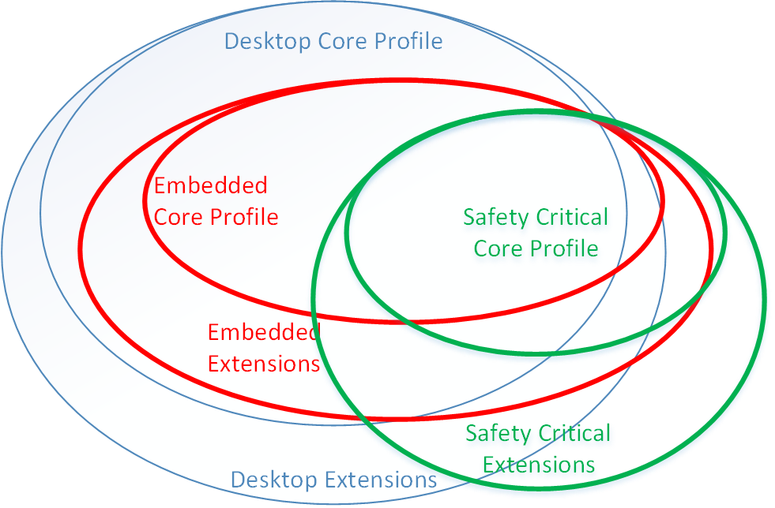

// (C) Copyright 2014-2017 The Khronos Group Inc. All Rights Reserved.
// Khronos Group Safety Critical API Development SCAP
// document
//
// Text format: asciidoc 8.6.9
// Editor:      Asciidoc Book Editor
//
// Description: Guidelines 3.2.4 Guidelines Bugzilla #16012

:Author: Illya Rudkin (spec editor)
:Author Initials: IOR
:Revision: 0.03

// Hyperlink anchor, the ID matches those in
// 3_1_GuidelinesList.adoc
[[b16012]]

ifdef::basebackend-docbook[]
=== The SC API
endif::[]
ifdef::basebackend-html[]
=== {chapter-id}.{chapter-sub-id}.{counter:section-id}. The SC API
endif::[]

The SC version of the API should be a subset of the API in question. Allowing applications written for the SC version of the API to compile, link and function using a library or driver which provides the more general API. By keeping the SC API as a subset we do not introduce more IP than that which exists in the already ratified version of the standard. From a Khronos perspective this simplifies IP rights and ratification of the SC standard.

This does not prevent addition of symbols (enumerations) where needed.

===== The Profile Triangle

[[ProfileTriangle, 3.2.4.1]]
.Profile triangle

xxxThe figure <<ProfileTriangle>> shows a common profiling pyramid where the Desktop profile exists as the largest set of APIs, and an Embedded version may remove functionality and APIs which are not required in that profile. The SC version of the API is normally a smaller subset than the Embedded version of the API.

While it is desirable that the SC version of an API be a proper subset of the either the Desktop or Embedded profiles of the version, a SC API may need to also add functionality to the proper subset to achieve proper functionality within a safety critical environment.

Unlike many APIs which evolve at a rapid pace, adding new features, fixing issues or removing obsolete features, SC APIs exist for considerably longer, easily up to 20+ years. This is because it can easily take more than 5 years between the time a project is started and the hardware selected to the time that hardware makes it through safety certification and in to a production period which can easily last another 15 years. All the while the software for such hardware can be upgraded.

Long hardware prototype times, limited quantities, and specialized SC driver development makes it unrealistic to provide each developer access to hardware running an implementation of the SC version of an API. As such SC APIs should try be a subset of the Desktop Profile and common extensions of the API to allow developers to do 90% or more of their development and testing on compatible Desktop implementations of the API. This also allows the developers to use the multitude of tools the base API provides to debug, troubleshoot, and optimize.

===== The Venn Diagram

[[ProfileVennDiagram, 3.2.4.2]]
.Profile Venn diagram

This Venn diagram shown in figure <<ProfileVennDiagram>> shows that while the profile triangle is a general rule of thumb, that the different profiles may include additional APIs and functionality to meet the requirements of the specific profile. It also shows that the SC Core API Profile can include Desktop Extensions and is not limited to only the Desktop Core API.

NOTE: The mixing of safe and non-safety critical code is generally not allowed in most safety standards unless it can be shown there is no possibility of interference by the non-safe code with safe code. The term refered to is partioning. The degree of partitioning that may need to be obtained according to a safety standard is generally the higher the critical function the more the seperation required. The same general rule applies where two different items or components with different levels of safety rigor applied (different levels of risk) are used in the same system. The component with the lower risk must not interfere with the part with the higher critical risk.
